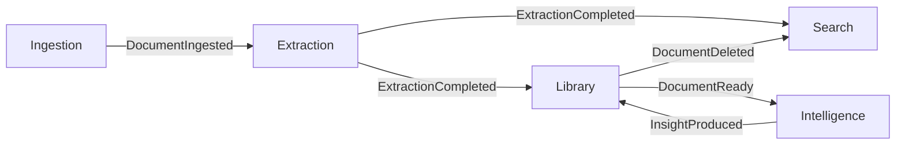
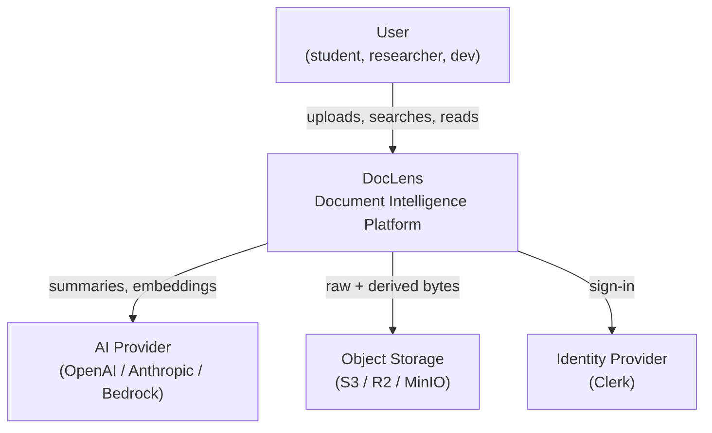
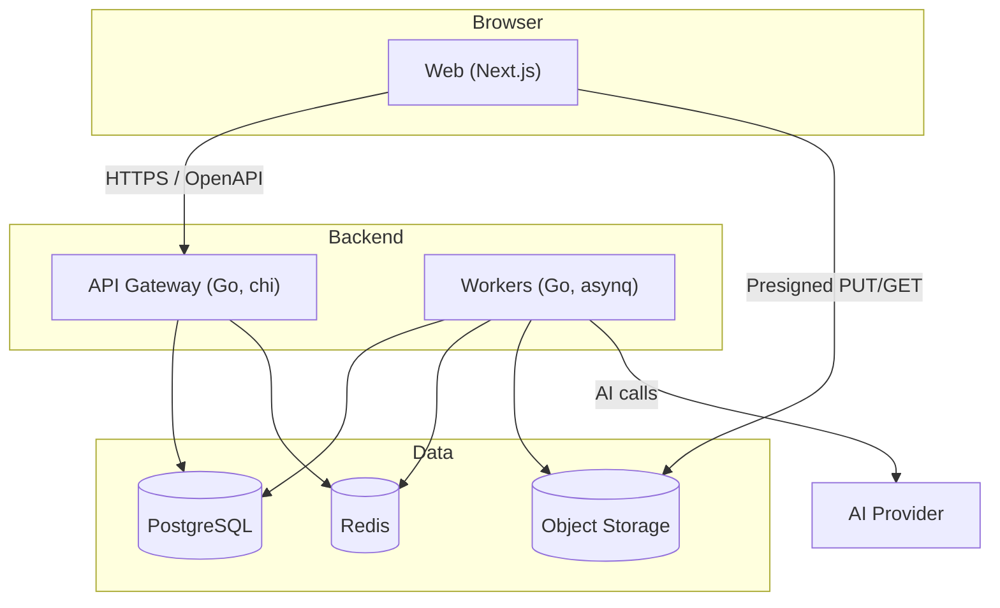
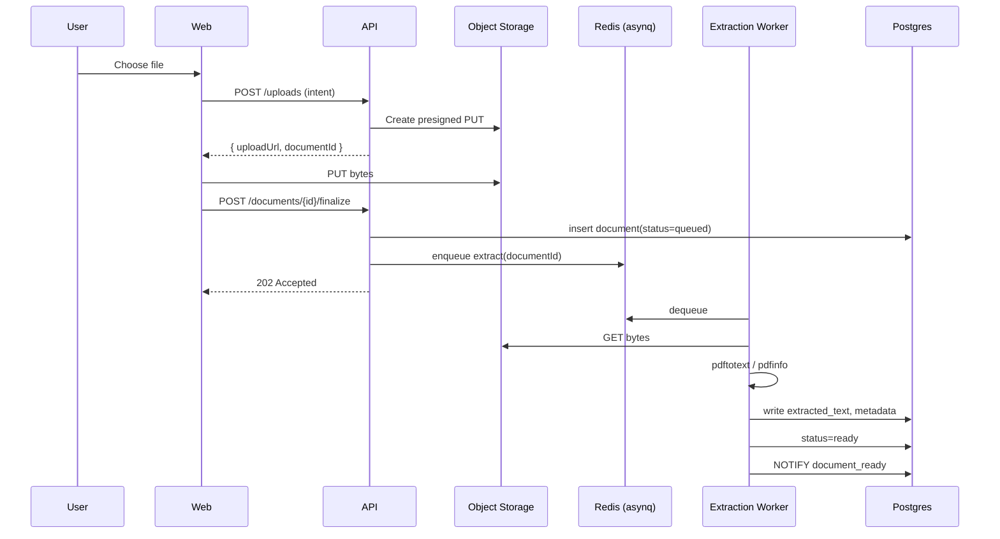

# DocLens — Architecture

Status: v0.1 Draft
Last updated: 2026-06-01

## 1. Purpose

DocLens turns documents (PDFs, papers, reports, manuals) into searchable, structured, AI-ready knowledge. The product goal is simple: a person uploads a document and within seconds can read a clean version, search it, ask questions about it, and see how it relates to their other documents.

This document is the architecture entry point. Decisions live in [`docs/adr/`](docs/adr). Active feature work lives in [`docs/specs/`](docs/specs).

## 2. Architectural Drivers

| Driver                                       | Implication                               |
| -------------------------------------------- | ----------------------------------------- |
| Heterogeneous document formats               | Pluggable extraction adapters per format  |
| Long-running, CPU-heavy work                 | Async jobs, not request/response          |
| AI provider churn (OpenAI/Anthropic/Bedrock) | Provider port + adapters                  |
| Open source, self-host friendly              | No vendor-only deps in the core path      |
| Extraction quality is the differentiator     | Confidence scoring, observability, replay |
| Roadmap v0.1 → v1.0                          | Bounded contexts that grow independently  |

## 3. Bounded Contexts

DocLens is split into five bounded contexts. Each owns its data, its language, and its workflow.

| Context          | Owns                                                          | Roadmap     |
| ---------------- | ------------------------------------------------------------- | ----------- |
| **Ingestion**    | Upload, validation, storage of raw bytes, deduplication       | v0.1        |
| **Extraction**   | Format adapters that produce text, tables, images, metadata   | v0.1        |
| **Library**      | User-facing catalog of documents, status, lifecycle, deletion | v0.1        |
| **Search**       | Full-text and (later) semantic indexing and query             | v0.1 → v0.4 |
| **Intelligence** | Summaries, entities, knowledge graph, confidence scoring      | v0.2+       |

A sixth concern, **Identity**, is treated as cross-cutting infrastructure (see [ADR 0008](docs/adr/0008-auth-strategy.md)).

## 4. Context Map



Relationships:

- Ingestion → Extraction: customer/supplier. Extraction depends on Ingestion's output schema.
- Extraction → Search and Library: published events.
- Library is the user-facing read model.
- Intelligence is downstream and additive; it never blocks the read path.

## 5. C4 — System Context



## 6. C4 — Containers



## 7. Document Lifecycle (v0.1)



## 8. Repository Layout

```
doclens/
├── apps/
│   ├── web/                 # Next.js 14 (App Router)
│   └── api/                 # Go HTTP gateway (chi)
├── services/
│   ├── ingestion/           # Go module: upload + validate
│   ├── extraction/          # Go module: parsers + workers
│   ├── library/             # Go module: catalog + lifecycle
│   ├── search/              # Go module: indexing + query
│   └── shared/              # auth, storage, jobs, eventbus
├── packages/
│   ├── ui/                  # Shared shadcn primitives
│   ├── api-client/          # OpenAPI-generated TS client
│   └── eslint-config/
├── infra/
│   ├── docker/              # docker-compose.dev.yml
│   ├── k8s/                 # Helm charts (later)
│   └── migrations/          # SQL migrations per context
├── docs/
│   ├── architecture/        # Diagrams, deep-dives
│   └── adr/                 # Architectural Decision Records
├── docs/specs/              # Feature specs
├── PROJECT.md               # This file
└── README.md
```

See [ADR 0002](docs/adr/0002-monorepo-structure.md) for why monorepo.

## 9. Cross-Cutting Concerns

- **Authentication.** All API routes require an authenticated identity (see ADR 0008). The `Authenticator` port lives in `services/shared/auth`.
- **Authorization.** Owner-based. A document belongs to exactly one user in v0.1; teams come later.
- **Configuration.** 12-factor. `viper` on the Go side, `@t3-oss/env-nextjs` on the web side.
- **Observability.** OpenTelemetry traces from web → api → workers. Structured logs (`slog`). Metrics via Prometheus. Sentry for errors.
- **Errors.** Domain errors are typed (e.g. `library.ErrNotFound`). HTTP layer maps to RFC 7807 problem+json.
- **Testing.** `testify` + `testcontainers-go` for backend integration tests. Vitest + Testing Library for web. Playwright end-to-end at v0.2+.

## 10. Ubiquitous Language

| Term           | Meaning                                                        |
| -------------- | -------------------------------------------------------------- |
| **Document**   | A user-uploaded file plus its derived artifacts                |
| **Artifact**   | A file produced from a document (extracted text, image, table) |
| **Extraction** | The act of producing artifacts from a document                 |
| **Confidence** | A 0–100 score indicating extraction reliability                |
| **Library**    | A user's collection of documents                               |
| **Ready**      | A document whose extraction completed without fatal errors     |
| **Insight**    | An AI-produced output (summary, entity, link) about a document |

## 11. Non-Goals (v0.1)

- Multi-tenant teams and roles
- Real-time collaborative editing of documents
- OCR for scanned documents (deferred to v0.2)
- Full knowledge graph (deferred to v0.3)
- Custom embeddings or fine-tuning

## 12. Decisions Index

See [`docs/adr/README.md`](docs/adr/README.md) for the full list. Highlights:

- [ADR 0002 — Monorepo with Turborepo and Go workspaces](docs/adr/0002-monorepo-structure.md)
- [ADR 0003 — Service boundaries aligned to bounded contexts](docs/adr/0003-service-boundaries.md)
- [ADR 0006 — Postgres + sqlc + pgx, no ORM](docs/adr/0006-postgres-sqlc-pgx.md)
- [ADR 0011 — OpenAPI-first API contract](docs/adr/0011-api-contract.md)
- [ADR 0012 — Microsoft MarkItDown as the extraction engine](docs/adr/0012-extraction-engine-markitdown.md)

## 13. Active Specs

- [`doclens-v0.1`](docs/specs/doclens-v0.1) — Upload → Extract → Read → Search
